# strcpy的溢出问题

## 测试代码

    #define _CRT_SECLRE_NO_WARNINGS //使strcpy函数可以使用

    #include<stdlib.h>
    #include<stdio.h>
    #include<string.h>

    int sub(char* x) {
      char y[10];
      strcpy(y, x);
      return 0;
    }

    int main(int argc, char** argv) { 
      if (argc > 1)
         sub(argv[1]);
         printf("exit");
    }

## 相关设置

* 打开该项目的属性设置，将“启用C++异常”设置为否，将“基本运行时检查”，设置为否，将“安全检查”设置为禁用安全检查  
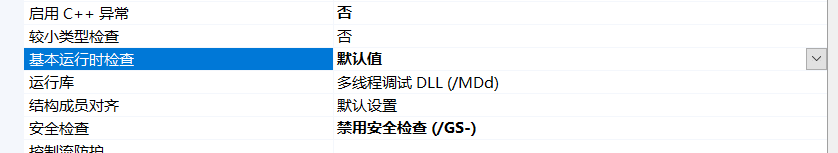

* 禁用SDL检查  
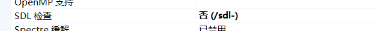

* 将调试里的命令参数设置为任意的字符串  
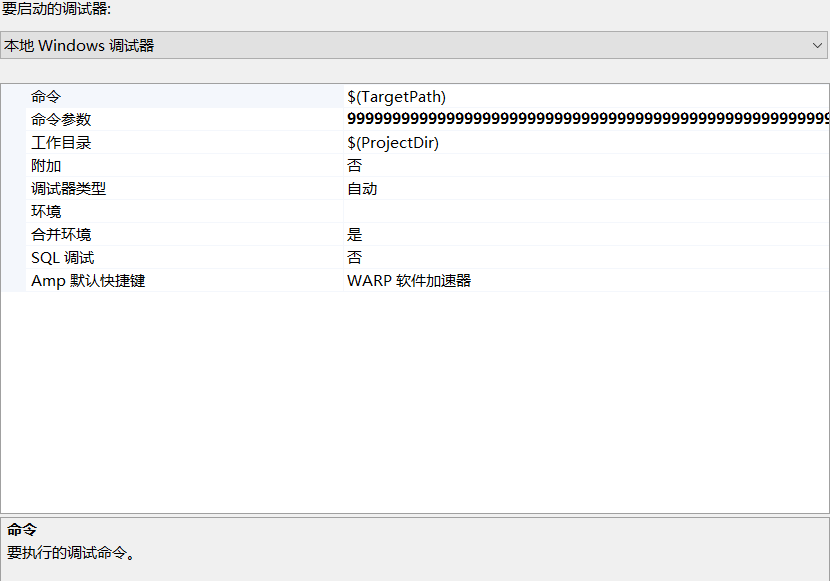

## 测试过程

* 在strcpy函数前设置断点，然后编译程序

* 启用反汇编，不显示符号名，显示代码字符，显示地址  
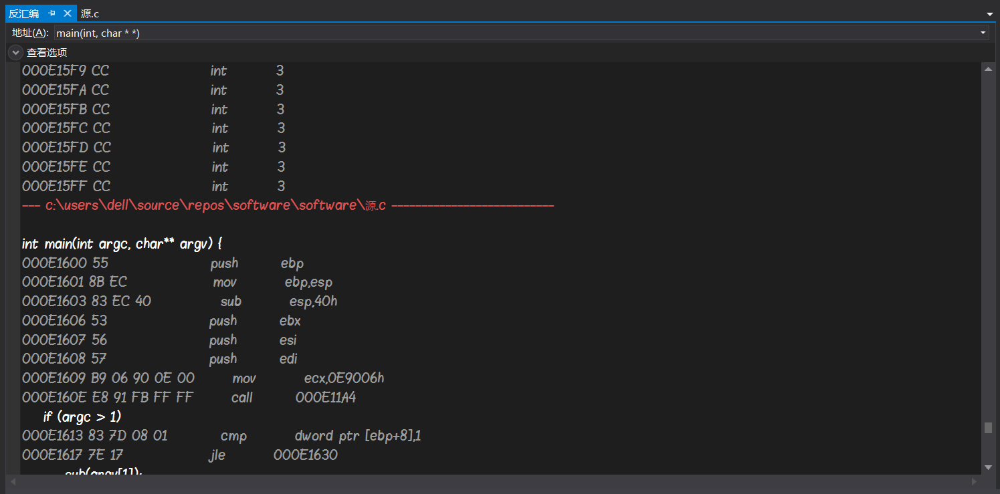

>* ESP 栈顶指针，堆栈的顶部是地址小的区域，压入堆栈的数据越多，ESP也就越来越小。在32位平台上，ESP每次减少4字节。
>* EBP 寄存器存放当前线程的栈底指针
>* EIP 寄存器存放下一个CPU指令存放的内存地址，当CPU执行完当前的指令后，从EIP寄存器中读取下一条指令的内存地址，然后继续执行。

* 当程序运行到断点位置时，EIP的地址与mov指令的地址相同  
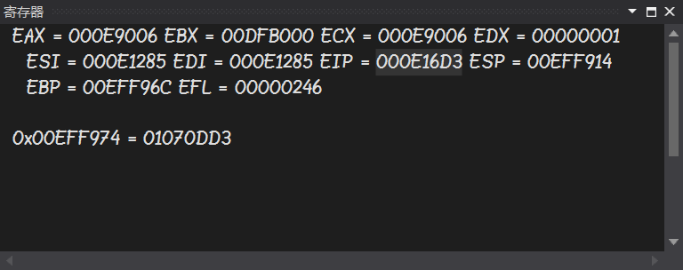
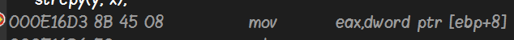

* 进入下一过程时，EIP发生了变化，EAX此时存放x的值，也发生了变化,将EAX的值压入栈中，栈顶指针ESP减少了四个字节  
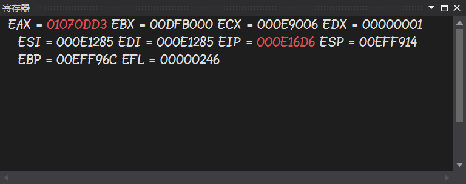
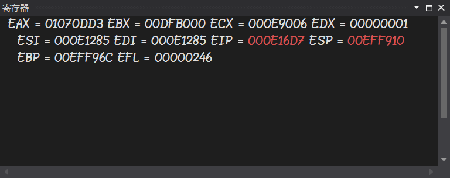

* 连续进行三个过程，EIP相应的发生了变化，ECX保存y的值，也进行了改变，同时，将y值压入了栈中，所以栈顶指针ESP减少了4个字节  
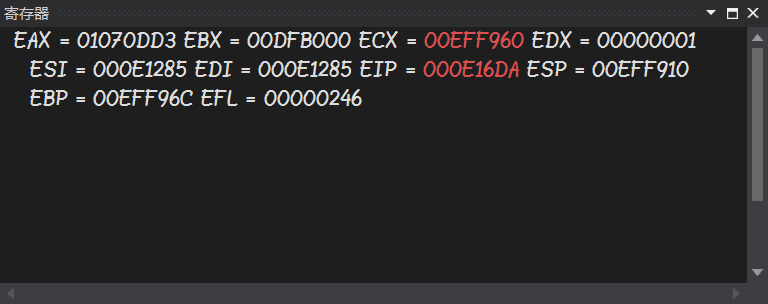

* 此时如果查看EAX中存储的值，即x的值时，会发现，EAX中存储的数值正是之前输入的任意字符串  
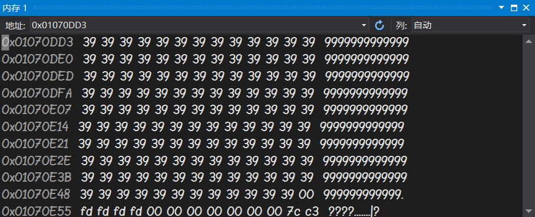

* 当程序进行到strcpy函数时，执行jump指令，EIP的值变化为jump后的地址，程序跳转到strcpy函数中进行  
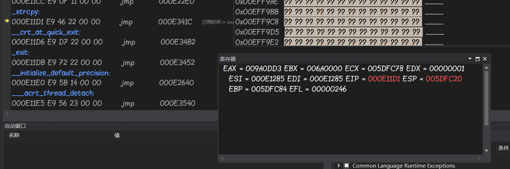

* EDX数据寄存器用于存放从x中拿到的数据，然后将数据给ECX  
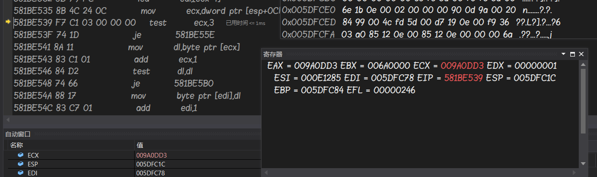

* 使程序继续往下进行，观察EAX和ECX中的值，发现ECX即y将x的值全部复制了过来，但是EAX中的值已经不可读  
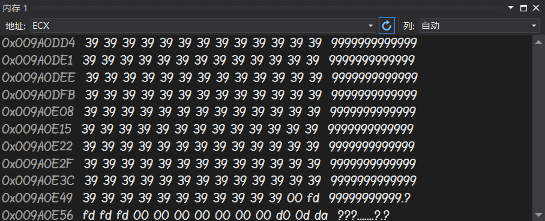
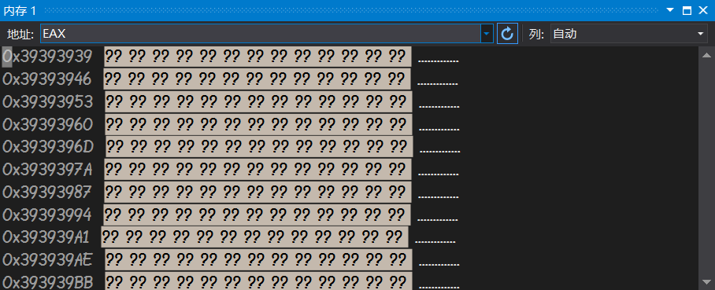
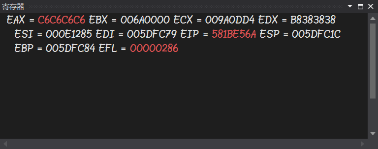
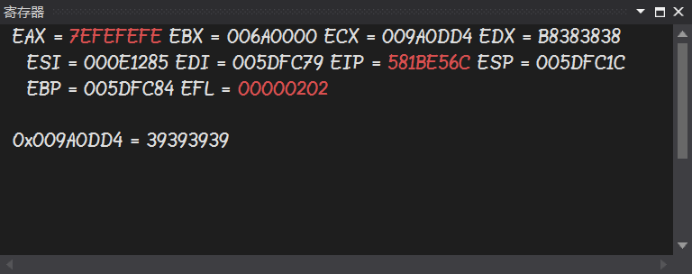

## 总结

在定义了x和y之后，因为y在栈中，存放于x之前，所以如果把x赋值给y，那么y在接受这个长字符串后，由于本身并无这么大的内存空间，就会发生溢出现象，占用x的内存和其他内存空间

00 | 00 | 00 | \0 | 9 | 9 | 9 |
-|-|-|-|-|-|-
y |  |  |  |x |

9 | 9 | 9 | 9 | 9 | 9 | 9 |
-|-|-|-|-|-|-
y |  |  |  |x |

将长字符串赋值给短字符串时，因为短字符串所占的内存空间不足，如果赋值，则会造成内存溢出现象，占用其他数据的内存空间，造成数据丢失等严重现象
