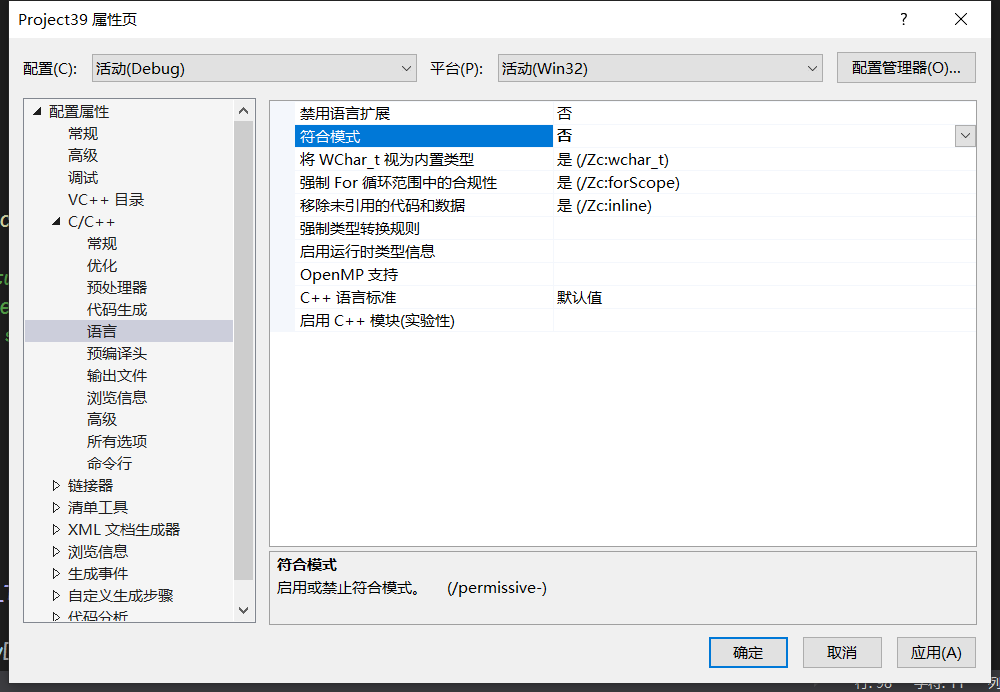
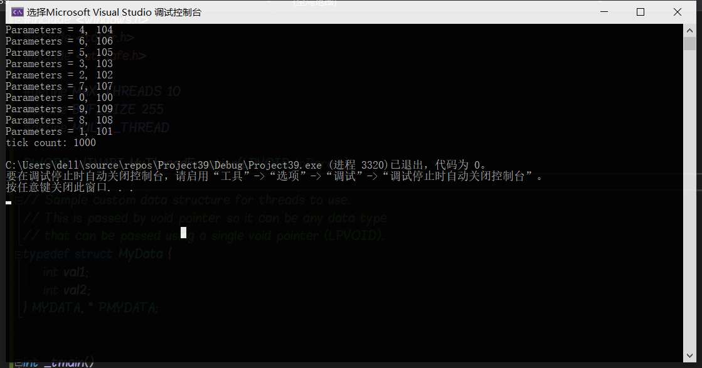
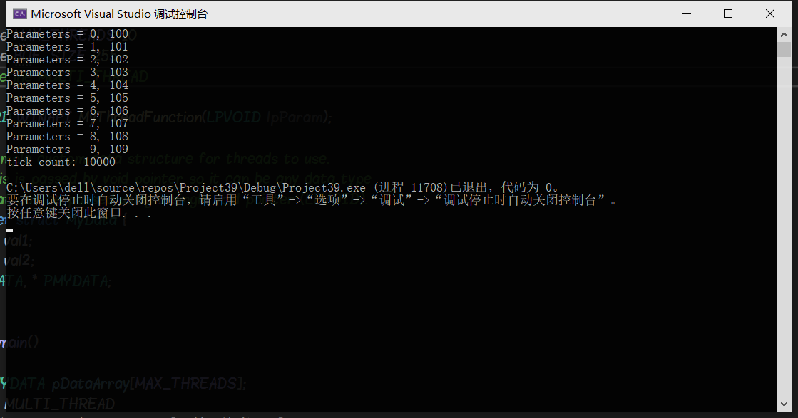
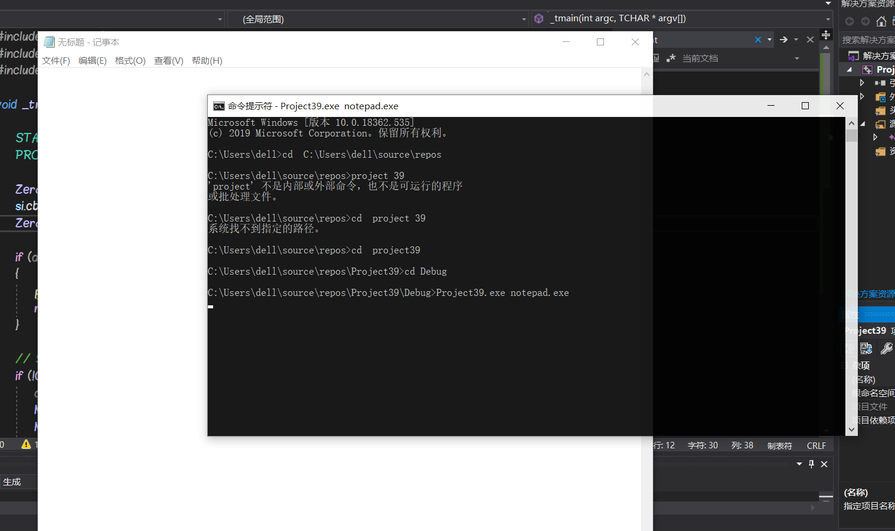
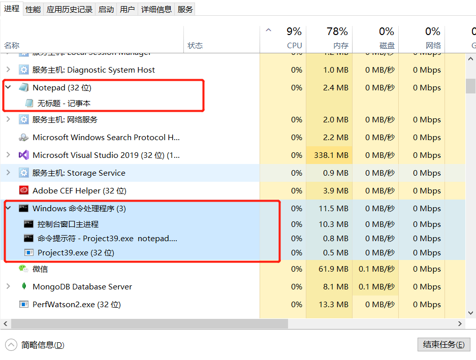

# Thread

> - 进程（Process）是计算机中的程序关于某数据集合上的一次运行活动，是系统进行资源分配和调度的基本单位，是操作系统结构的基础。在早期面向进程设计的计算机结构中，进程是程序的基本执行实体；在当代面向线程设计的计算机结构中，进程是线程的容器。程序是指令、数据及其组织形式的描述，进程是程序的实体。
> - 线程（英语：thread）是操作系统能够进行运算调度的最小单位。它被包含在进程之中，是进程中的实际运作单位。一条线程指的是进程中一个单一顺序的控制流，一个进程中可以并发多个线程，每条线程并行执行不同的任务。在Unix System V及SunOS中也被称为轻量进程（lightweight processes），但轻量进程更多指内核线程（kernel thread），而把用户线程（user thread）称为线程

## 实验过程及分析

### 线程

#### 实验代码

```c++
#include <windows.h>
#include <tchar.h>
#include <strsafe.h>

#define MAX_THREADS 10
#define BUF_SIZE 255
#define MULTI_THREAD

DWORD WINAPI MyThreadFunction(LPVOID lpParam);

// Sample custom data structure for threads to use.
// This is passed by void pointer so it can be any data type
// that can be passed using a single void pointer (LPVOID).
typedef struct MyData {
    int val1;
    int val2;
} MYDATA, * PMYDATA;


int _tmain()
{
    PMYDATA pDataArray[MAX_THREADS];
#ifdef MULTI_THREAD
    DWORD   dwThreadIdArray[MAX_THREADS];
    HANDLE  hThreadArray[MAX_THREADS];
#endif

// Create MAX_THREADS worker threads.

    DWORD start = GetTickCount();

    for (int i = 0; i < MAX_THREADS; i++)
    {
        // Allocate memory for thread data.

        pDataArray[i] = (PMYDATA)malloc(sizeof(MYDATA));

        if (pDataArray[i] == NULL)
        {
            // If the array allocation fails, the system is out of memory
            // so there is no point in trying to print an error message.
            // Just terminate execution.
            ExitProcess(2);
        }

        // Generate unique data for each thread to work with.

        pDataArray[i]->val1 = i;
        pDataArray[i]->val2 = i + 100;

        // Create the thread to begin execution on its own.

#ifdef MULTI_THREAD

        hThreadArray[i] = CreateThread(
            NULL,                   // default security attributes
            0,                      // use default stack size  
            MyThreadFunction,       // thread function name
            pDataArray[i],          // argument to thread function
            0,                      // use default creation flags
            &dwThreadIdArray[i]);   // returns the thread identifier

        // Check the return value for success.
        // If CreateThread fails, terminate execution. 
        // This will automatically clean up threads and memory. 

        if (hThreadArray[i] == NULL)
        {
            printf("CreateThread Error(%d)", GetLastError());
            ExitProcess(3);
        }
#else
        MyThreadFunction(pDataArray[i]);
#endif
    } // End of main thread creation loop.

    // Wait until all threads have terminated.
#ifdef MULTI_THREAD
    WaitForMultipleObjects(MAX_THREADS, hThreadArray, TRUE, INFINITE);
#endif

    DWORD end = GetTickCount();
    printf("tick count: %d\n", end - start);

    // Close all thread handles and free memory allocations.
#ifdef MULTI_THREAD

    for (int i = 0; i < MAX_THREADS; i++)
    {
        CloseHandle(hThreadArray[i]);
        if (pDataArray[i] != NULL)
        {
            free(pDataArray[i]);
            pDataArray[i] = NULL;    // Ensure address is not reused.
        }
    }
#endif
    return 0;
}


DWORD WINAPI MyThreadFunction(LPVOID lpParam)
{
    PMYDATA pDataArray;
    pDataArray = (PMYDATA)lpParam;
    Sleep(1000);
    printf("Parameters = %d, %d\n", pDataArray->val1, pDataArray->val2);
    return 0;
}

```

#### 代码注解

- 代码来源于<https://docs.microsoft.com/en-us/windows/win32/api/processthreadsapi/nf-processthreadsapi-createthread>，该网址中给出了Windows系统中创建线程的部分函数，对其进行修改和删除错误代码部分后，可以运行

- CreateThread函数在Windows下运行创建多线程，注释掉第七行的宏定义，即为单线程。

#### 运行环境

- VS2019

- 修改相关项目设置


#### 运行结果



#### 分析

- CreateThread（）函数创建了10个线程，根据函数的运行结果可以看到，这10个线程的执行顺序并不是1，2，3这样顺序执行的，而是错乱排序。说明了这10个线程在产生之后，由于不同系统的调度顺序不同，所以线程的执行时间也不同，但是这10个线程的运行时间大体相同，均为1000ms。

- tick count记录了从开始创建线程到线程全部执行结束的时间

- 多线程调度时，10个线程的运行总体时间约为每个线程运行的时间

- 在注释掉第七行代码后，程序由多线程变成了单线程执行，可以看到运行的结果输出为0，1，2，按顺序输出


- 函数的运行总时长约为10个线程的总调度时间，即一个线程的运行时间的10倍

- 由此可见，多线程调度的效率远比但线程调度的效率高

### 进程

- 在Windows下，使用CreateProcess（）函数来创建进程，CreateProcess函数创建了一个新的进程和它的主线程，这个新创建的进程可以运行指定的可执行的文件

- CreateProcess（）函数如下：

```c++
BOOL CreateProcess(
　LPCTSTR lpApplicationName, // 应用程序名称
　LPTSTR lpCommandLine, // 命令行字符串
　LPSECURITY_ATTRIBUTES lpProcessAttributes, // 进程的安全属性
　LPSECURITY_ATTRIBUTES lpThreadAttributes, // 线程的安全属性
　BOOL bInheritHandles, // 是否继承父进程的属性
　DWORD dwCreationFlags, // 创建标志
　LPVOID lpEnvironment, // 指向新的环境块的指针
　LPCTSTR lpCurrentDirectory, // 指向当前目录名的指针
　LPSTARTUPINFO lpStartupInfo, // 传递给新进程的信息
　LPPROCESS_INFORMATION lpProcessInformation // 新进程返回的信息
);
```

#### 程序代码

```c++
#include <windows.h>
#include <stdio.h>
#include <tchar.h>

void _tmain(int argc, TCHAR* argv[])
{
    STARTUPINFO si;
    PROCESS_INFORMATION pi;

    ZeroMemory(&si, sizeof(si));
    si.cb = sizeof(si);
    ZeroMemory(&pi, sizeof(pi));

    if (argc != 2)
    {
        printf("Usage: %s [cmdline]\n", argv[0]);
        return;
    }

    // Start the child process. 
    if (!CreateProcess(NULL,   // No module name (use command line)
        argv[1],        // Command line
        NULL,           // Process handle not inheritable
        NULL,           // Thread handle not inheritable
        FALSE,          // Set handle inheritance to FALSE
        0,              // No creation flags
        NULL,           // Use parent's environment block
        NULL,           // Use parent's starting directory 
        &si,            // Pointer to STARTUPINFO structure
        &pi)           // Pointer to PROCESS_INFORMATION structure
        )
    {
        printf("CreateProcess failed (%d).\n", GetLastError());
        return;
    }

    // Wait until child process exits.
    WaitForSingleObject(pi.hProcess, INFINITE);

    // Close process and thread handles. 
    CloseHandle(pi.hProcess);
    CloseHandle(pi.hThread);
}
```

- 代码选自<https://docs.microsoft.com/en-us/windows/win32/api/processthreadsapi/nf-processthreadsapi-createprocessa>

#### 实验过程

- 使用命令行运行exe文件创建进程notepad.exe


- 打开任务管理器，可以看到notepad.exe和project39.exe同时在运行


- 关闭notepad.exe可以看到project39.exe一起被关闭

说明子进程运行完毕后父进程也关闭，可以推断notepad.exe为createprocess.exe创建的子进程

#### 实验结果分析

CreateProcess通过内核创建进程的步骤，大致分为六个阶段：

1. 打开目标映像文件
    > 对于32位exe映像，CreateProcess先打开其映像文件，在为其创建一个Section即文件映射区，将文件内容映射进来，前提是目标文件是一个合格的EXE文件（PE文件头部检测）；

2. 创建内核中的进程对象
    > 实际上就是创建以EPROCESS为核心的相关数据结构，这就是系统调用NtCreateProcess()要做的事情

3. 创建初始线程
    > 与EPROCESS对应，线程的数据结构是ETHREAD，与进程环境块PEB对应，线程也有线程环境块TEB；PEB在用户空间的位置大致是固定的，在7ffd0000左右，PEB的下方就是TEB，进程有几个线程就有几个TEB，每个TEB占一个4KB的页面

4. 通知windows子系统
    >每个进程在创建/退出的时候都要向windows子系统进程csrss.exe进程发出通知，因为它担负着对windows所有进程的管理的责任，注意，这里发出通知的是CreateProcess的调用者，不是新建出来的进程，因为它还没有开始运行。

5. 启动初始线程
    >新创建的线程未必是可以被立即调度运行的，因为用户可能在创建时把标志位CREATE_ SUSPENDED设成了1；如果那样的话，就需要等待别的进程通过系统调用恢复其运行资格以后才可以被调度运行。

6. 用户空间的初始化和Dll连接
    >DLL连接由ntdll.dll中的LdrInitializeThunk()在用户空间完成。在此之前ntdll.dll与应用软件尚未连接，但是已经被映射到了用户空间.函数LdrInitializeThunk()在映像中的位置是系统初始化时就预先确定并记录在案的，所以在进入这个函数之前也不需要连接

### 参考资料

<https://www.cnblogs.com/Gotogoo/p/5262536.html>